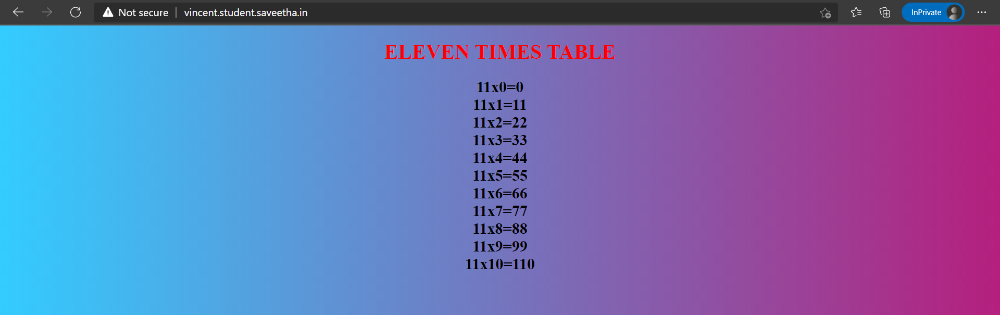
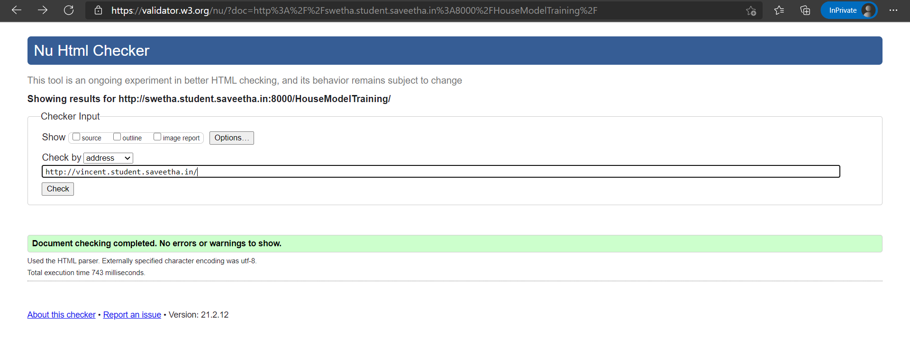

# Developing a Simple Webserver
## AIM:
To develop a simple webserver to serve html pages.

## DESIGN STEPS:
### Step 1: 
HTML content creation
### Step 2:
Design of webserver workflow
### Step 3:
Implementation using Python code
### Step 4:
Serving the HTML pages.
### Step 5:
Testing the webserver

## PROGRAM:
```
from http.server import HTTPServer,BaseHTTPRequestHandler

content = """
<!DOCTYPE html>
<html lang="en">
<head>
<title>TABLES</title>
<style>
div.a {
  text-align: center;
}
</style>
</head>
<body style="background:linear-gradient(to right, #33ccff 0%, #cc0066 118%)">
<div class="a">
<h1 style="color:red"><b>ELEVEN TIMES TABLE</b><br></h1>
<h2 style="color:black">
11x0=0<br>
11x1=11<br>
11x2=22<br>
11x3=33<br>
11x4=44<br>
11x5=55<br>
11x6=66<br>
11x7=77<br>
11x8=88<br>
11x9=99<br>
11x10=110</h2>
</div>


</body>
</html>
"""

class MyHandler(BaseHTTPRequestHandler):
       def do_GET(self):
        print("request recived")

        #To creat response header
        self.send_response(200)
        self.send_header('comment-type', 'text/html; charset=utf-8')
        self.end_headers()
        
        #To send the response
        self.wfile.write(content.encode())

#To creat server address
server_address = ('', 80)

#To creat server object
httpd = HTTPServer(server_address,MyHandler)

#To lesten at the specified port
print("my webserver is running...")
httpd.serve_forever()
```

## OUTPUT:



## CODE VALIDATION REPORT:




## RESULT:
Thus a website is designed for a simple webserver to serve html pages and is hosted in the URL : http://vincent.student.saveetha.in/ . HTML code is validated.
